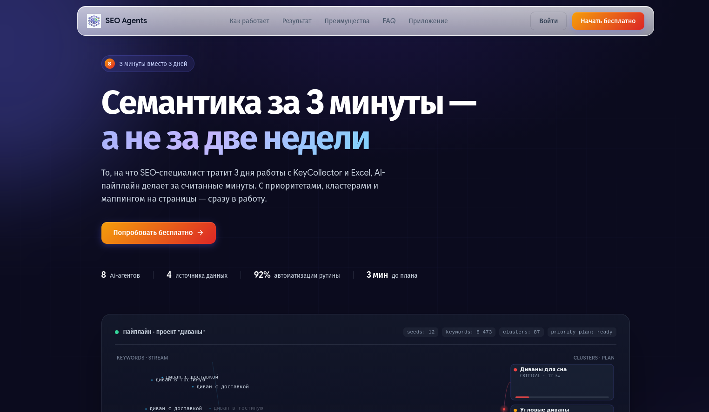

# SEO Agents — AI-платформа для работы с семантическим ядром



Платформа автоматизации работы с коммерческим семантическим ядром на базе 8 AI-агентов. Конвейер из специализированных агентов выполняет полный цикл: от исследования и расширения семантики до кластеризации, маппинга на страницы и приоритизации — за минуты вместо дней ручной работы.

## Возможности

- **8 AI-агентов** в едином конвейере: исследование → расширение → очистка → определение интента → кластеризация → маппинг → приоритизация → обратная связь
- **Мультимодельная архитектура** через OpenRouter (Kimi K2.6, GLM 5.1, Qwen 3.6 Plus)
- **Автоматическое расширение семантики** через Google Suggest, Google Trends и LLM-генерацию long-tail запросов
- **Интеллектуальная кластеризация** с определением поискового интента (коммерческий, транзакционный, информационный и др.)
- **Маппинг на страницы сайта** с рекомендациями по действиям (создать, обновить, объединить)
- **Приоритизация по 7 факторам** с весовой формулой и уровнями critical/high/medium/low
- **Real-time мониторинг** выполнения пайплайна через SSE
- **Экспорт результатов** в CSV
- **Дизайн-система** — профессиональный UI с собственными токенами, Google Sans Flex, Heroicons

## Технологический стек

| Компонент | Технология |
|---|---|
| Backend | Python 3.11+, FastAPI, asyncio |
| LLM | OpenRouter API (OpenAI-совместимый SDK) |
| База данных | SQLite + SQLAlchemy (async) |
| Frontend | Jinja2, Tailwind CSS, Server-Sent Events |
| Контейнеризация | Docker, Docker Compose |
| Данные | Google Suggest API, pytrends, sitemap-парсинг |

## Архитектура агентов

```
ResearchAgent → ExpansionAgent → CleaningAgent → IntentAgent
    → ClusteringAgent → MappingAgent → PrioritizationAgent → FeedbackAgent
```

1. **ResearchAgent** — анализ сайта клиента и конкурентов (sitemap, meta-теги)
2. **ExpansionAgent** — расширение семантики (Google Suggest + Trends + LLM long-tail)
3. **CleaningAgent** — очистка от мусорных и нерелевантных запросов
4. **IntentAgent** — классификация поискового интента (7 типов)
5. **ClusteringAgent** — группировка ключевых слов в тематические кластеры
6. **MappingAgent** — привязка кластеров к страницам сайта
7. **PrioritizationAgent** — скоринг по 7 факторам с весовой формулой
8. **FeedbackAgent** — подготовка данных для пост-аналитики (GSC интеграция)

## Быстрый старт

### Локальный запуск

```bash
git clone https://github.com/Habartru/semantic_agentic_sistem.git
cd semantic_agentic_sistem/seo-agents
python -m venv .venv
source .venv/bin/activate
pip install -r requirements.txt
cp .env.example .env
# Укажите ваш OpenRouter API ключ в .env
uvicorn app.main:app --host 0.0.0.0 --port 8000 --reload
```

### Docker

```bash
cd seo-agents
cp .env.example .env
# Укажите ваш OpenRouter API ключ в .env
docker compose up -d
```

Приложение будет доступно на `http://localhost:8000`

## Структура проекта

```
seo-agents/
├── app/
│   ├── agents/          # 8 AI-агентов + оркестратор
│   ├── services/        # LLM, Google Suggest, Trends, парсинг
│   ├── templates/       # Jinja2 шаблоны (лендинг + приложение)
│   ├── static/          # CSS, JS, шрифты, логотипы
│   ├── config.py        # Конфигурация
│   ├── models.py        # SQLAlchemy модели
│   └── main.py          # FastAPI приложение
├── docker-compose.yml
├── Dockerfile
├── requirements.txt
└── .env.example
```

## Лицензия

MIT
